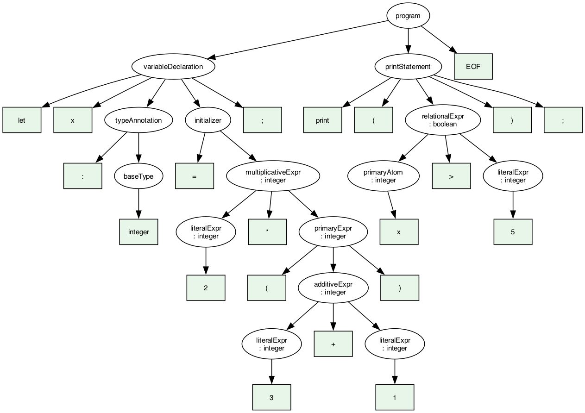

# Arquitectura de la implementación

## Visión general

```
 archivo.cps ──► CompiscriptLexer ──► CompiscriptParser ──► árbol sintáctico (ANTLR)
                   (generados desde program/Compiscript.g4)          │
                                                                      ▼
                                                        SemanticAnalyzer (Visitor)
                                                   ┌──────────┴──────────┐
                                                   ▼                     ▼
                                            SymbolTable            ErrorCollector
                                       (entornos + símbolos)   (errores sintácticos
                                                                 y semánticos)
                                                   │                     │
                              ┌────────────────────┼─────────────────────┤
                              ▼                    ▼                     ▼
                         Driver.py (CLI)     ide/ (Flask + web)    tests/ (pytest)
```

El pipeline es **parsear → visitar → reportar**. Nunca se lanza una excepción
por un error del programa fuente: todos se acumulan en `ErrorCollector` y se
reportan juntos con línea y columna. Si hay errores sintácticos la fase
semántica no se ejecuta (el árbol estaría incompleto y generaría ruido).

## Módulos

| Módulo | Responsabilidad |
|---|---|
| `program/Compiscript.g4` | Gramática del curso, extendida con el tipo `float` (`FloatLiteral` y `'float'` en `baseType`). |
| `compiscript/generated/` | Lexer, parser y visitor generados por ANTLR 4.13.1 (`make grammar`). |
| `compiscript/parsing.py` | Construye el árbol; redirige los errores de ANTLR al colector. |
| `compiscript/errors.py` | `CompilerError` (fase, línea, columna, mensaje) y `ErrorCollector`. |
| `compiscript/types.py` | Sistema de tipos y reglas de compatibilidad. |
| `compiscript/symbols.py` | Símbolos, entornos (`Scope`) y `SymbolTable`. |
| `compiscript/semantic/` | Visitor semántico, dividido en mixins por área de reglas. |
| `compiscript/tree_viz.py` | Árbol en texto, LISP, JSON y Graphviz DOT/SVG. |
| `Driver.py` | Interfaz de línea de comandos. |
| `ide/` | IDE web (Flask + CodeMirror). |
| `tests/` | Batería de pruebas (pytest), un archivo por grupo de reglas. |
| `examples/` | Programas válidos e inválidos usados por el IDE y los tests. |

## Sistema de tipos (`types.py`)

Los tipos son objetos comparables por valor:

* **Primitivos:** `integer`, `float`, `string`, `boolean`, `null`, `void`
  (funciones sin retorno) y `<error>`.
* **`ArrayType(element)`**: `integer[]`, `integer[][]`, `Animal[]`…
* **`ClassType(name, parent)`**: tipo nominal; `is_subclass_of` recorre la
  cadena de herencia.
* **`FunctionType(params, returns)`**: tipo de una función usada como valor;
  permite detectar expresiones sin sentido como `f * 2` o `print(f)`.

El tipo `<error>` es un **tipo veneno**: cuando una subexpresión falla se le
asigna `<error>` y todas las reglas lo aceptan silenciosamente. Así un solo
error (por ejemplo una variable no declarada) produce un único mensaje y no
una cascada.

Reglas de compatibilidad (`is_assignable`, `are_comparable`, `are_orderable`,
`common_type`):

* Asignación exige el mismo tipo; una subclase es asignable a su superclase;
  `null` es asignable a referencias (`string`, arreglos, objetos); `[]` es
  asignable a cualquier arreglo.
* `==`/`!=` exigen tipos iguales, clases relacionadas o comparación con `null`.
* `<`, `<=`, `>`, `>=` exigen `integer` en ambos lados.
* `+` con un `string` en cualquier lado es concatenación (como en TypeScript y
  como usa `program.cps` del curso: `"5 + 1 = " + addFive`). El resto de la
  aritmética exige operandos numéricos (`integer` o `float`).
* **Promoción numérica:** un `integer` puede usarse donde se espera un `float`
  (asignación, argumentos, retorno, elementos de arreglo) y una operación
  aritmética con al menos un `float` produce `float`. Lo inverso es error:
  un `float` nunca se convierte implícitamente a `integer`. `%` y los índices
  de arreglos exigen `integer`.

> La gramática original del curso no definía `float`. Se extendió el lexer con
> `FloatLiteral: [0-9]+ '.' [0-9]+` y `baseType` con `'float'` para cubrir el
> requerimiento "los operandos deben ser de tipo `integer` o `float`".

## Tabla de símbolos (`symbols.py`)

### Símbolos

`Symbol(name, kind, type, line, column, scope, initialized, offset, captured)`.
Categorías (`SymbolKind`): `variable`, `constant`, `parameter`, `function`,
`method`, `class`, `field`. Dos especializaciones:

* `FunctionSymbol`: parámetros, tipo de retorno, entorno del cuerpo, variables
  capturadas (closures) y si tiene `return` con valor.
* `ClassSymbol`: clase padre y entorno de miembros; `lookup_member` busca por
  la cadena de herencia y `constructor()` devuelve el constructor si existe.

Cada símbolo guarda además `size` y `offset` dentro de su entorno, pensados
para la fase de generación de código.

### Entornos

`Scope(kind, parent, owner)` con `kind ∈ {global, function, class, block,
loop, switch}`. Se crea un entorno nuevo por **cada función, clase, bloque,
bucle, `case` y `catch`**. Operaciones:

* `define(sym)` → `False` si ya existe en ese entorno (redeclaración).
* `resolve(name)` recorre la cadena de padres (local → global).
* `enclosing_function()`, `enclosing_class()`, `in_loop()`, `in_breakable()`
  responden preguntas de contexto (¿estoy en una función?, ¿en un bucle?),
  deteniéndose en el límite de la función para que un `break` dentro de una
  función anidada en un bucle sea error.

`SymbolTable` mantiene el entorno global, el actual (`push`/`pop`) y la lista
completa de entornos creados, que el IDE y el Driver muestran como tabla.

## Analizador semántico (`semantic/`)

`SemanticAnalyzer` hereda del `CompiscriptVisitor` generado y combina mixins:

| Archivo | Reglas |
|---|---|
| `base.py` | Reporte de errores, resolución de anotaciones de tipo, recorrido de listas de sentencias con **detección de código muerto**, entornos de bloque, **hoisting**. |
| `expressions.py` | Tipado de literales, arreglos, unarios, binarios (aritmética, lógica, comparaciones), ternario, asignaciones como expresión, llamadas (número y tipo de argumentos), `new`, `this`, índices, acceso a miembros y **captura de closures**. |
| `declarations.py` | `let`/`var`/`const` (tipo declarado vs. inferido, `const` inicializada), asignaciones como sentencia, `print`. |
| `functions.py` | Firma y cuerpo de funciones, parámetros duplicados, `return` (dentro de función, tipo correcto, obligatorio si hay tipo de retorno), recursión y funciones anidadas. |
| `control_flow.py` | Condiciones booleanas en `if/while/do-while/for`, entornos de bucle, `foreach` sobre arreglos, `switch` con `case` comparables, `try/catch`, `break`/`continue` solo en bucles. |
| `classes.py` | Herencia (padre existente, sin ciclos), miembros, constructor, sobreescritura con la misma firma, `this` solo en métodos. |

Cada `visitXxx` de expresión devuelve el `Type` calculado y lo registra en
`node_types` (el IDE lo muestra en el árbol).

### Hoisting

Antes de visitar las sentencias de un bloque se registran los **nombres de las
clases** y las **firmas de las funciones** de ese bloque. Esto permite llamar a
una función declarada más abajo, usar una clase como tipo antes de su
declaración y que los métodos de una clase se invoquen entre sí sin importar
el orden. Las redeclaraciones se detectan en este mismo paso.

### Código muerto

`visit_statements` marca como inalcanzable la primera sentencia que sigue a un
`return`, `break` o `continue` dentro del mismo bloque. Un `return` dentro de
un `if` no hace muerto lo que sigue al `if`.

## IDE (`ide/`)

* **Backend** (`app.py`): Flask. `POST /api/analyze` devuelve errores, filas de
  la tabla de símbolos, entornos y el árbol en JSON. `POST /api/tree.svg`
  genera la imagen con Graphviz. `GET /api/examples` sirve `examples/`.
* **Frontend** (`static/`): CodeMirror con resaltado, marcadores de error en el
  gutter y la línea, pestañas de errores (clic → salta a la línea), tabla de
  símbolos y árbol colapsable con el tipo de cada expresión. El análisis se
  ejecuta en vivo mientras se escribe.

## Árbol sintáctico (`tree_viz.py`)

El árbol de ANTLR se puede ver en cuatro formas: texto indentado (`--tree`),
notación LISP (`--lisp`), JSON (IDE) y Graphviz (`--dot`, SVG/PNG). Para las
representaciones gráficas se colapsan las cadenas de reglas con un solo hijo
(`expression → assignmentExpr → … → primaryExpr`) para que el dibujo sea legible.



## Decisiones de diseño

* **Tipo veneno** para evitar cascadas de errores.
* **`+` concatena** cuando un operando es `string` (compatibilidad con el
  programa de ejemplo del curso).
* **`break` en `switch`** se acepta (semántica de TypeScript); `continue` solo
  en bucles.
* La variable de `catch` se tipa como `string`.
* Una variable declarada sin valor debe recibir una asignación antes de leerse
  (análisis independiente del flujo: basta una asignación previa en el código).
* Los archivos generados por ANTLR se versionan para que el proyecto corra sin
  Java; `make grammar` los regenera si la gramática cambia.
